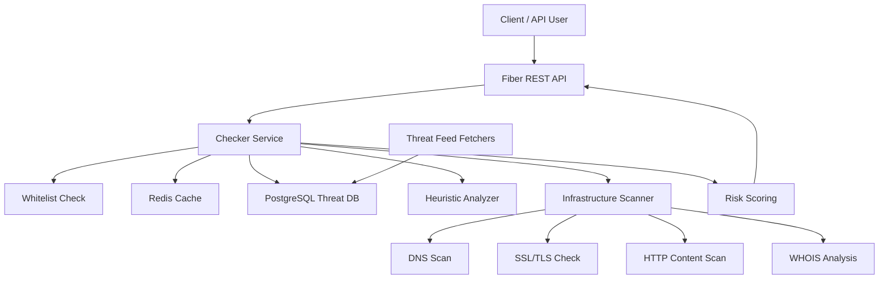

# 🛡️ Scam Checker API

Threat Intelligence API and phishing scanner built with Go.

Scam Checker API detects phishing, malware, scam URLs, suspicious domains, and risky infrastructure using public threat feeds, heuristic analysis, Redis caching, and live URL scanning.


---

## Features

| Feature             | Description                                                                           |
| ------------------- | ------------------------------------------------------------------------------------- |
| Threat feeds        | Aggregates phishing and malware URLs from multiple public sources                     |
| Heuristic analysis  | Detects typosquatting, brand injection, suspicious keywords, entropy, and obfuscation |
| Infrastructure scan | Checks DNS, SSL, HTTP content, redirects, and hosting signals                         |
| Smart scoring       | Produces risk score from 0 to 100                                                     |
| Redis cache         | Speeds up repeated checks                                                             |
| PostgreSQL storage  | Stores normalized threat intelligence data                                            |
| Docker support      | Runs API, PostgreSQL, and Redis locally                                               |

---

## Threat Intelligence Sources

* PhishTank
* URLhaus
* OpenPhish
* ThreatFox
* GitHub Phishing Database
* VX Vault
* Phishing Army
* StopForumSpam

---

## Architecture



---

## Smart Pipeline

1. **Whitelist Check** — trusted domains return immediately.
2. **Redis Cache** — repeated checks are resolved quickly.
3. **Database Lookup** — URL hash is checked against stored threat feeds.
4. **Heuristic Analysis** — suspicious URL structure is analyzed.
5. **Infrastructure Scan** — DNS, SSL, WHOIS, and HTTP signals are checked.
6. **Risk Scoring** — signals are normalized into final verdict.

---

## Tech Stack

* Go
* Fiber
* PostgreSQL
* Redis
* Docker
* pgx
* MaxMind GeoLite2
* Public threat intelligence feeds

---

## Project Structure

```text
cmd/
└── api/                 # API entrypoint

config/                  # App configuration

internal/
├── app/                 # Server and background workers
├── domain/              # Domain models
├── repository/          # PostgreSQL repositories
├── service/
│   ├── analyzer/        # Heuristic analysis
│   ├── cache/           # Redis cache
│   ├── fetcher/         # Threat feed fetchers
│   ├── infra/           # DNS / SSL / HTTP scanner
│   ├── whois/           # WHOIS analysis
│   ├── checker.go       # Main checking logic
│   └── whitelist.go
└── transport/
    └── rest/            # HTTP handlers
```

---

## Getting Started

### Prerequisites

* Docker
* Docker Compose
* MaxMind GeoLite2 City database
* MaxMind GeoLite2 ASN database

---

### Clone

```bash
git clone https://github.com/cobrich/scam-checker-api.git
cd scam-checker-api
```

---

### GeoIP Databases

Download from MaxMind:

* `GeoLite2-City.mmdb`
* `GeoLite2-ASN.mmdb`

Place both files in the project root.

---

### Environment

```env
APP_PORT=:8080
DATABASE_URL=postgres://user:password@db:5432/scam_db
REDIS_URL=redis://redis:6379/0
RUN_FETCHERS=true
```

---

### Run

```bash
docker compose up -d --build
```

API will be available at:

```text
http://localhost:8080
```

---

## API

### Check URL

```http
GET /api/check?url=http://secure-login-apple.com&full=true
```

| Parameter | Type    | Description                 |
| --------- | ------- | --------------------------- |
| url       | string  | URL to analyze              |
| full      | boolean | Enables infrastructure scan |

---

### Example Response

```json
{
  "target": "http://secure-login-apple.com",
  "verdict": "Dangerous",
  "risk_score": 100,
  "reason": "Suspicious Activity Detected",
  "signals": [
    "Typosquatting",
    "Brand Injection",
    "No HTTPS"
  ],
  "infrastructure": {
    "status": "Online",
    "ip": "1.2.3.4"
  }
}
```

---

### Health Check

```http
GET /health
```

```json
{
  "status": "ok"
}
```

---

## Engineering Highlights

* Concurrent URL analysis pipeline
* Redis-backed cache for repeated queries
* PostgreSQL batch inserts for threat feeds
* Smart scoring system
* Anti-false-positive logic
* Infrastructure scanning
* Dockerized local environment
* Modular Go project structure

---

## Roadmap

* [x] Threat feed aggregation
* [x] URL risk scoring
* [x] Redis caching
* [x] PostgreSQL persistence
* [x] DNS / SSL / HTTP scanning
* [x] Docker Compose setup
* [ ] API authentication
* [ ] Admin dashboard
* [ ] Prometheus metrics
* [ ] Background feed update scheduler
* [ ] Public API documentation
* [ ] Rate limiting
* [ ] CI/CD pipeline

---

## Lessons Learned

Building Scam Checker API helped me improve:

* Go backend architecture
* Threat intelligence data processing
* Concurrent network scanning
* PostgreSQL optimization
* Redis caching
* Docker-based development
* REST API design
* Security-focused backend development

---

## License

This project is licensed under the MIT License.

---

## Author

Bekzat Tursun

GitHub: https://github.com/cobrich
